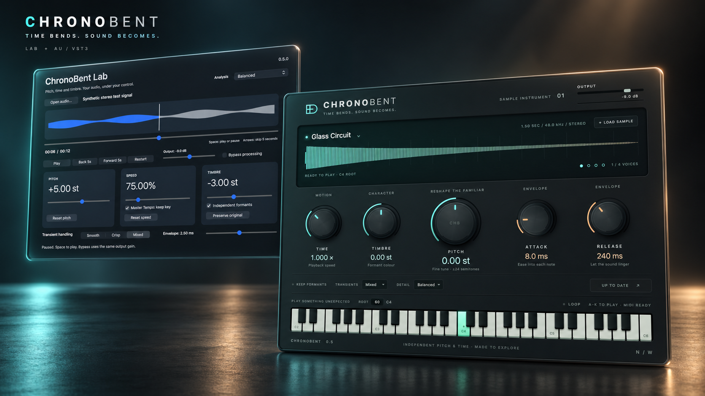

<div align="center">

# ChronoBent

**Time bends. Sound becomes.**



**Play a sample. Reimagine a track. Build something of your own.**

[Instrument](#chronobent-instrument) · [FX](#chronobent-fx) · [Lab](#chronobent-lab) · [Note Studio](#note-studio) · [Build the SDK](#build) · [API](API.md) · [Releases](https://github.com/nicolaswehmeyer/ChronoBent/releases)

</div>

## One engine. Three ways to explore.

**ChronoBent Instrument** turns a sound into something you can play. Load a sample,
pull its pitch and time in separate directions, colour its timbre, and find a new
part on the keyboard. A sculpted dark interface puts five tactile controls,
a luminous waveform and four voices within reach.

**ChronoBent FX** shapes the audio already in your session. Bend pitch and timbre
on an audio track, blend the result with the original, or capture a passage and
explore its time independently. The same sculpted controls, made for an insert.

**ChronoBent Lab** gives an entire track room to move. Change key without changing
speed, slow a passage while keeping its key, audition a different timbre, or jump
through the waveform and compare against bypass. A native macOS workspace for
listening, experimenting and understanding the engine.

| | Instrument | FX | Lab |
| --- | --- | --- | --- |
| Start with | A factory sound or sample | Audio from your track | A local audio file |
| Work in | AU/VST3 instrument track | AU/VST3 audio insert | Standalone macOS app |
| Explore | Four-voice MIDI, envelope and loop | Live pitch/timbre, wet/dry and captured loops | Playback, seek and Master Tempo |
| Pitch | ±24 st knob plus ±24 st keyboard | ±24 st | ±48 st |
| Speed | 0.5×–2× | 0.5×–2× on a capture; live input stays 1× | 50%–200% |
| Platform | macOS 11+, Apple Silicon/Intel | macOS 11+, Apple Silicon/Intel | macOS 11+, Apple Silicon/Intel |

The image above is a generated 3D presentation based on the actual application
interfaces. These are software tools; no physical hardware is required.

## Get ChronoBent

**0.6.0 is a release candidate.** Source builds are available now. Lab 0.6.0 and
Instrument/FX 0.6.0 universal packages are awaiting Apple notarization; their public
binary download is not ready yet. [Previously verified Lab 0.2.0](https://github.com/nicolaswehmeyer/ChronoBent/releases/download/v0.2.0/ChronoBent-Lab-0.2.0-macOS-universal.dmg)
remains available and has an earlier feature set.

- **Make music:** [build the AU/VST3 instrument and effect](plugin/README.md#build-the-plugins).
- **Explore audio:** [build ChronoBent Lab](#chronobent-lab).
- **Develop:** use the MIT C++17 library through its C ABI or C++ wrapper.

The AU targets Logic Pro and other AU hosts; Ableton Live can use VST3
or AU on macOS. Automated format/native-host validation is recorded in
[the plugin guide](plugin/README.md). Direct Logic Pro and Ableton Live session
checks remain outstanding; this is not a claim of qualification in every DAW.

## ChronoBent Instrument

Choose **Glass Circuit**, **Soft Current** or **Copper Bloom**, or load your own
sample. Set **Pitch**, **Time** and **Timbre**, wait for **Ready to Play**, and
play a melody or chord. The instrument keeps transformed
duration independent of the note you play.

- Four voices, velocity, sustain pedal, loop and a directly playable keyboard.
- Fine pitch and independent formant colour, with three transient modes and
  three analysis profiles.
- Automatable attack, release, output and loop controls; preparation controls
  prepare the sound by themselves once a change settles, before playing.
- Embedded sample and settings in your DAW project, so the original file can move.
- Local processing, local interface assets and system fonts. No account or
  network service is needed to make sound.

Drag knobs, Shift-drag for finer control, double-click to reset, or type a value.
Samples can be mono or stereo, up to 120 seconds. This first release does not
implement pitch wheel, MPE, slicing or host-tempo sync. See the
[complete controls, installation and workflow](plugin/README.md).

## ChronoBent FX

Insert **ChronoBent FX** on an audio track. Shape **Pitch** and **Timbre** while
it plays, automate the controls and use **Mix** to bring the original back in.
For independent time changes, press **Capture**, record a passage, then press
**Play Capture**. The captured loop can run at half to double speed while its
pitch stays where you set it. **Live** returns to the track input.

- Mono/stereo audio input with linked stereo processing and dry/wet alignment.
- Automatable pitch, timbre, transient mode, formant preservation, mix and output.
- Captures from 50 ms to 30 seconds, embedded with settings in the DAW project.
- Smooth control/source transitions and a visible latency/status readout.

FX reports its processing delay to the host: 216 ms at 48 kHz. Enable your DAW's
plugin delay compensation for track alignment; monitoring through the effect
still has that delay. Live input keeps normal speed. The **Time** knob applies
to a captured loop, and is disabled in Live mode. Select an explicit bounce range
because loops can continue indefinitely. See the [FX workflow and limits](plugin/README.md#chronobent-fx).

## Note Studio

Correct a recorded vocal or solo melody in **all three tools**. Analyze its pitch,
choose a key and scale, preserve vibrato or correct drift, and drag individual
notes to new targets. Switch between original and corrected audio explicitly.
Lab can export the corrected source as a float WAV; plugins keep both versions
and note edits in your project.

Note Studio handles one melodic line with up to ±5 semitones of correction.
FX uses a finished capture. It is not polyphonic separation or a low-latency
microphone effect. [Open the workflow and SDK guide](TUNING.md) for controls,
limits, ownership and a compiled C++ example.

## The DSP inside

The same independent engine is available for your own player, editor or renderer.
Your application owns storage, scheduling and audio devices; ChronoBent supplies
the processing and source timeline.

| Control | SDK capability |
| --- | --- |
| Tempo | 0.25 to 4 times speed, independent of pitch |
| Pitch | Up to four octaves down or up, selected at creation |
| Formants | Preserve the original envelope or shift it independently by up to an octave |
| Transients | Smooth, Crisp and Mixed handling |
| Analysis | Compact, Balanced and Detailed window profiles |
| Channels | 1 to 8 with linked phase processing |
| Playback | Seek, parameter crossfades, planar or interleaved output |
| Integration | C ABI, C++ wrapper, CMake package, static or shared library |

Processing contracts have automated tests. Musical transparency is not established
across all material and settings, and extreme shifts can expose artifacts. Source
audio must support random-access reads. FX supplies its own bounded input cache
and worker outside the DSP, with the additional host latency described above.
See [quality and limits](QUALITY.md) and [the changelog](CHANGELOG-DSP.md).

## Build

Requires CMake 3.16+, a C/C++17 compiler and the C++ standard library.
The DSP has no third-party runtime dependencies. No dependencies are downloaded
by the build. The default test selection also uses Python 3.

```sh
cmake -S . -B build -DCMAKE_BUILD_TYPE=Release
cmake --build build --config Release --parallel
ctest --test-dir build -C Release --output-on-failure
cmake --install build --config Release --prefix /your/install/prefix
```

Link from your own CMake project:

```cmake
find_package(chronobent CONFIG REQUIRED)
target_link_libraries(your_target PRIVATE chronobent::chronobent)
```

Static C consumers must enable the C++ linker. For other build systems,
[sources.txt](sources.txt) and [sources.mk](sources.mk) list the DSP units.
The package is tested with static/shared builds on Linux, macOS and Windows.

| CMake option | Default | Purpose |
| --- | --- | --- |
| `BUILD_SHARED_LIBS` | `OFF` | Shared library with exported C symbols |
| `CHRONOBENT_BUILD_TUNING` | `ON` | Optional recorded-monophonic analysis and correction; OFF preserves the legacy-only SDK |
| `CHRONOBENT_BUILD_TESTS` | `ON` | DSP, API, player, instrument, effect and renderer regressions |
| `CHRONOBENT_BUILD_EXAMPLES` | `ON` | WAV renderer, benchmark and C/C++ consumers |
| `CHRONOBENT_BUILD_PITCH_LAB` | `OFF` | Native macOS audition app |
| `CHRONOBENT_BUILD_PLUGINS` | `OFF` | macOS AU/VST3 instrument and effect with pinned external dependencies |
| `CHRONOBENT_SANITIZE` | `OFF` | Address and undefined-behavior sanitizers |

## C++ integration

```cpp
#include <chronobent/chronobent.hpp>

chronobent_config config{};
auto status = chronobent_config_for_profile(
    48000, 2, CHRONOBENT_PROFILE_BALANCED, &config);
if (status != CHRONOBENT_OK) return;

chronobent_cpp::Processor processor(config, 1024, {.0625, 16});
auto controls = chronobent_default_controls();
controls.tempo = 1.25;       // 25% faster.
controls.pitch = 1.0;        // Original key: Master Tempo.
controls.formant_scale = 1;  // Original spectral envelope.
controls.transients = CHRONOBENT_TRANSIENT_MIXED;

status = processor.set_source_controls(reader, user, input_frames, controls);
if (status == CHRONOBENT_OK) {
    size_t produced = 0;
    status = processor.render(output, requested_frames, produced);
    // Consume exactly produced frames, including on END or source error.
    // Continue until END, handling a source error before retrying.
}
```

This fragment assumes the host supplies `reader`, source storage and output
buffers. [processor_cpp.cpp](examples/processor_cpp.cpp) is a complete compiled
example. The wrapper owns its processor and is move-only. Construction can
throw; processing methods return C status values.

## C integration

The same processor is available without a C++ wrapper:

```c
chronobent_config config = chronobent_default_config(48000, 2);
chronobent_controls controls = chronobent_default_controls();
chronobent_processor *processor = NULL;
chronobent_pitch_range range = {.0625, 16};
chronobent_status status = chronobent_processor_create_with_pitch_range(
    &config, 1024, &range, &processor);
if (status == CHRONOBENT_OK) {
    status = chronobent_processor_set_source_controls(
        processor, reader, user, input_frames, &controls);
    /* Render, seek and change controls on the same worker thread. */
    chronobent_processor_destroy(processor);
}
```

Include [chronobent.h](include/chronobent/chronobent.h). The runnable
[processor_c.c](examples/processor_c.c) also demonstrates the retained 0.2 API.
Use the fixed-epoch API when your host already owns parameter transitions.

## Pitch, tempo and formants

`tempo` is input frames per output frame. `pitch` is output frequency divided by
input frequency. Convert semitones with `exp2(semitones / 12.0)`.
The new constructors accept a range within `[1/16, 16]` that includes unity.
For example, `{.25, 4}` allows ±24 semitones; `{.0625, 16}` allows ±48.
Existing constructors keep ±12 semitones. The range is fixed for the lifetime
of the instance and applies to every pitch setter. Filter memory grows with the
selected maximum. Extreme shifts can lose bandwidth and introduce artifacts;
the accepted range is not a transparency guarantee.

| Intent | Tempo | Pitch | Formant scale |
| --- | --- | --- | --- |
| Master Tempo at 125% | `1.25` | `1` | `0` or `1` |
| Up an octave, same duration | `1` | `2` | `0` to follow pitch, `1` to preserve timbre |
| Turntable-style playback | `1.25` | `1.25` | `0` |
| Change timbre without transposing | `1` | `1` | `exp2(formant_semitones / 12.0)` |

`formant_scale = 0` follows the pitch naturally. An explicit scale is relative
to the original source envelope. Envelope correction is approximate and bounded;
it cannot reconstruct missing harmonics or isolate a voice from a mix.

Longer analysis windows resolve closer low-frequency components but can soften
attacks. The profiles expose that tradeoff, without promising a universally best
setting. [API.md](API.md) documents exact windows, limits and control behavior.

## Host responsibilities

1. Supply immutable, interleaved float audio through a random-access callback.
2. Create and bind a processor on a rendering worker.
3. Apply coherent controls on that worker and fill a bounded output queue.
4. Let the audio callback consume prepared frames, with silence on underrun.
5. Flush queued output on seek and stop callbacks/workers before releasing storage.

After creation, processor calls allocate nothing and take no locks, excluding
work done by the source callback. Control changes and seeks can read history
and regenerate tables, so they belong on the worker. The DSP starts no threads,
performs no I/O and opens no audio device. The legacy processor working memory does not grow with
track length. The optional tuner preallocates derived state proportional to the
recording length; see [its separate contract](TUNING.md).

`BUSY` means a previous parameter fade must finish. Coalesce control changes and
retry after rendering. Source failures preserve the returned valid prefix and
allow retry. The [API reference](API.md) specifies ownership, thread, timing and
failure contracts. The [Lab player](examples/pitch_lab/player.cpp) shows queue
ownership and seek handoff around the public API.

## WAV renderer

Raise pitch by one semitone at the original tempo:

```sh
build/chronobent-render input.wav shifted.wav 1 1.059463094
```

Change timbre at the original pitch, with a detailed analysis window:

```sh
build/chronobent-render input.wav timbre.wav 1 1 mixed 1.189207115 2 detailed
```

Arguments after tempo and pitch select `tonal`/`transients`/`mixed`,
`shift`/`preserve`/an explicit formant ratio, envelope resolution in milliseconds,
and `compact`/`balanced`/`detailed`. The renderer reads PCM16/24/32 or float32 WAV
and writes float32 WAV. It rejects malformed input and existing output paths.
It loads the source into memory. On Windows, use `build/Release/chronobent-render.exe`.

## ChronoBent Lab

Build the 0.6.0 app below while its universal package awaits notarization.
It targets macOS 11 or later on Apple Silicon and Intel. The controls described
here belong to 0.6.0; the earlier verified 0.2.0 download has fewer features.

Open a track, then press **Space** to play or pause. Drag the position slider to
seek, or use the **arrow keys** to skip five seconds. Restart returns to the
beginning. Speed ranges from 50% to 200%. Master Tempo starts enabled.

Pitch ranges from -48 to +48 semitones. Pitch, speed and timbre have separate controls. Enable independent formants and
leave timbre at zero to preserve the original envelope. Choose a transient mode
and analysis profile for your material. Bypass restores original pitch and speed.
The output gain applies equally to processed and bypass audio; it starts at
-9 dB to leave room for processed peaks. There is no hidden limiter.

The app uses Cocoa and AVFoundation and decodes local mono/stereo files at
8 to 192 kHz, up to 64 million frames. A worker feeds a 4096-frame queue.
Controls crossfade over 1024 frames; seek discards stale queued audio and blends
into the new position. The display follows consumed source positions.
The decoded source is shared immutably when changing analysis profiles.

Build the app from source:

```sh
cmake -S . -B build-mac -DCMAKE_BUILD_TYPE=Release -DCHRONOBENT_BUILD_PITCH_LAB=ON
cmake --build build-mac --parallel
open 'build-mac/ChronoBent Lab.app'
```

## Measure and contribute

[QUALITY.md](QUALITY.md) separates numerical tests, performance measurements and
listening work. [DESIGN.md](DESIGN.md) explains the signal path. Run the tests
before proposing DSP changes, describe the material and settings that improve,
and include regressions that protect timing, stereo and source lifetime.

The [MIT license](LICENSE) permits use in open-source and commercial software.
Keep its copyright and license notice with redistributed copies.
[export-files.txt](export-files.txt) lists the reviewed source and exact owned marketing image;
`python3 tools/export_source.py /path/to/new.zip` scans it with Gitleaks and creates
a deterministic source archive.
